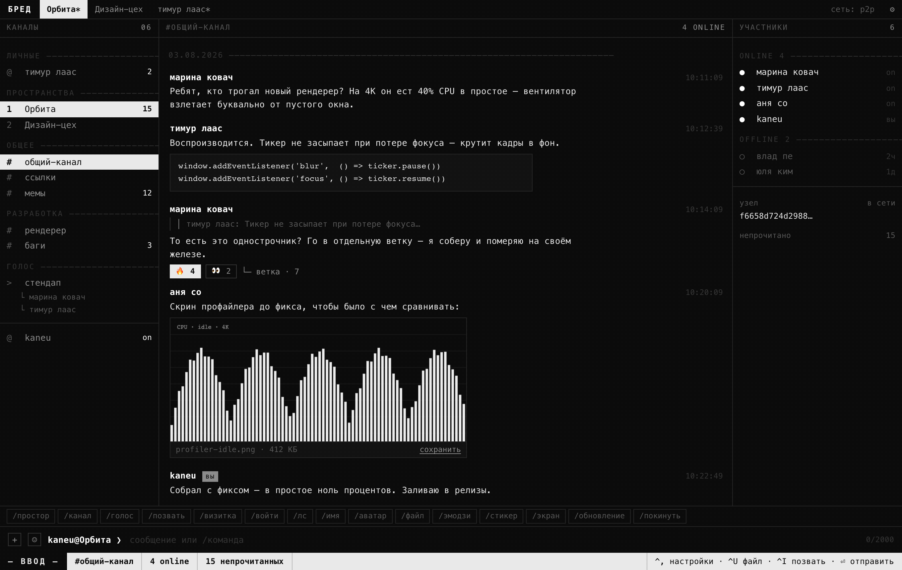
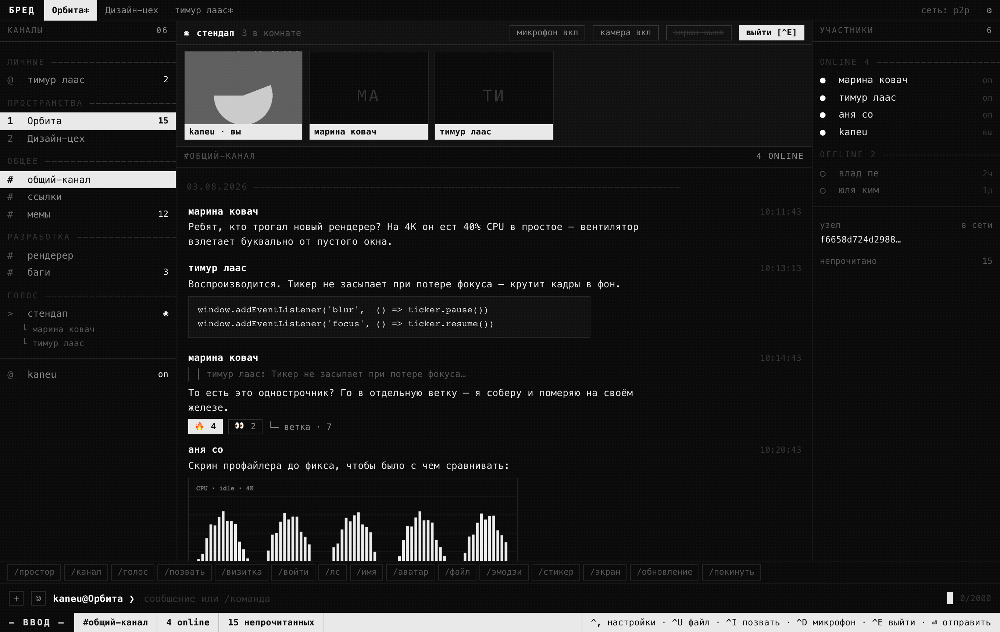
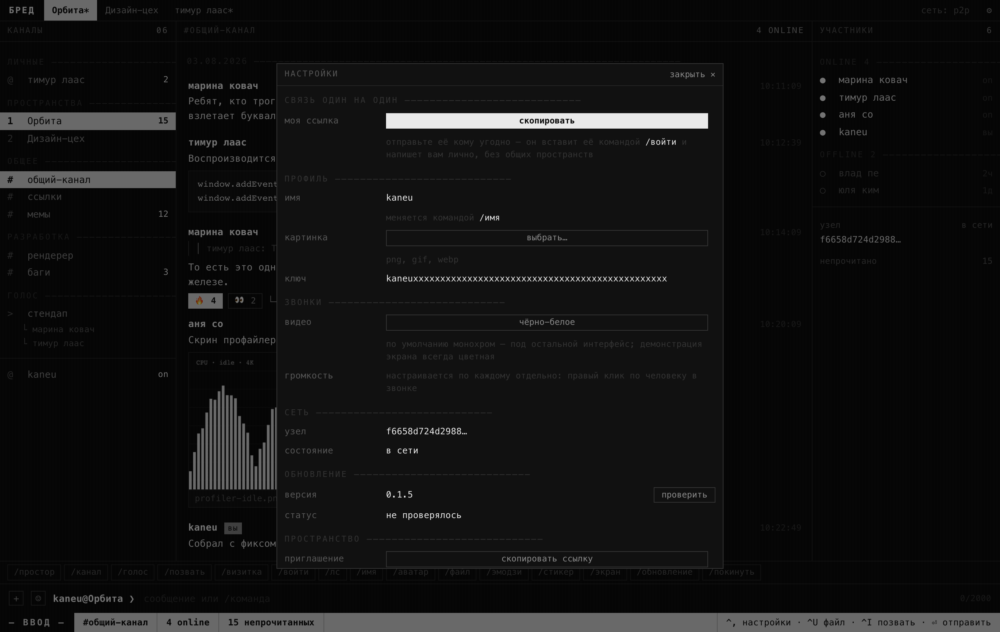

<p align="center">
  
</p>

<h1 align="center">БРЕД</h1>

<p align="center">
  <b>Б</b>ыстрая <b>Р</b>етрансляция <b>Э</b>лектронных <b>Д</b>анных<br />
  Чат, файлы и звонки напрямую между людьми — без единого сервера
</p>

<p align="center">
  <a href="https://github.com/Arti-Ko/bred/releases/latest">Скачать</a> ·
  <a href="#с-чего-начать">С чего начать</a> ·
  <a href="#как-позвонить">Позвонить</a> ·
  <a href="ARCHITECTURE.md">Как устроено внутри</a>
</p>

---

## Что это

Обычный мессенджер: каналы, переписка, файлы, голосовые и видеозвонки. Разница
в том, что **посредника между вами нет**. Сообщения идут напрямую с вашего
компьютера на компьютер собеседника и хранятся у вас обоих. Никакой компании
посередине, никакой регистрации, никакой почты и пароля.

Отсюда приятные следствия: работает в локальной сети вообще без интернета,
переписку невозможно прочитать со стороны, а сервис нельзя закрыть или
заблокировать — закрывать нечего.



## Установка

1. Откройте [страницу загрузки](https://github.com/Arti-Ko/bred/releases/latest).
2. Скачайте файл под свою систему:
   - **Mac с процессором Apple (M1–M4)** — `..._aarch64.dmg`
   - **Mac на Intel** — `..._x64.dmg`
   - **Windows** — `..._x64-setup.exe`
3. Откройте скачанный файл и перетащите приложение в «Программы» (на Mac) или
   пройдите установку (на Windows).

> **Важно на Mac.** Приложение не подписано сертификатом Apple — это стоит
> 99 $ в год, и такого сертификата пока нет. Поэтому при первом запуске система
> скажет, что файл повреждён. Он не повреждён. Откройте приложение **правым
> кликом → «Открыть»** и подтвердите. Если не помогло, выполните в Терминале:
>
> ```bash
> xattr -dr com.apple.quarantine /Applications/БРЕД.app
> ```
>
> На Windows похожая история: SmartScreen покажет предупреждение — нажмите
> «Подробнее» → «Выполнить в любом случае».

## С чего начать

Регистрации нет. При первом запуске приложение само создаёт ваш ключ — он и есть
ваша личность. Всё управление живёт в **строке внизу**: туда пишут сообщения и
туда же вводят команды. Над строкой — полоса команд, по ним можно просто
кликать, запоминать ничего не нужно.

### Шаг 1. Назовитесь

Нажмите `/имя` в полосе команд, допишите своё имя и нажмите Enter:

```
/имя Кирилл
```

В ленте серой строкой появится подтверждение. Так отвечает любая команда — вы
всегда видите результат.

### Шаг 2. Создайте пространство

Пространство — это то, что в других мессенджерах называют сервером: набор
каналов, где сидит компания людей.

```
/простор Наша компания
```

Внутри сразу появится канал `#общий-канал`. Можно добавить ещё:

```
/канал баги
```

### Шаг 3. Позовите человека

Нажмите `/позвать` (или клавиши `Ctrl+I`). В буфер обмена ляжет ссылка вида
`bred://join/…`.

**Отправьте её другу любым способом** — телеграмом, почтой, чем угодно. Своего
способа доставки у БРЕД нет и быть не может: пока вы не связаны, вы друг для
друга не существуете.

Друг вставляет ссылку у себя, нажав `/войти` и добавив её:

```
/войти bred://join/…
```

Через несколько секунд он окажется в пространстве и получит всю историю
переписки — она приедет прямо от вас.

> Пока он подключается **первый раз**, вы должны быть в сети: истории и адреса
> взять больше неоткуда. Дальше это уже неважно.

### Шаг 4. Пишите

Выберите канал слева и пишите в строку внизу. Enter отправляет,
`Shift+Enter` переносит строку.

Что ещё умеет лента:

- **Ответить на сообщение** — кликните по нему, появится кнопка «ответить».
- **Поставить реакцию** — кликните по сообщению и нажмите «＋ реакция».
- **Обсудить отдельно** — кнопка «ветка» открывает боковую ветку.
- **Отправить файл** — кнопка `+` слева от строки ввода или команда `/файл`.
  Картинки видны прямо в ленте, у каждого файла есть кнопка «сохранить».

## Как позвонить



Звонок живёт в голосовом канале — как в Дискорде.

1. Создайте голосовой канал (один раз): `/голос созвон`
2. **Кликните по нему** в списке слева — вы в звонке. Система один раз спросит
   доступ к микрофону, разрешите.
3. Собеседник кликает по тому же каналу — и вы разговариваете.

В панели звонка сверху кнопки «камера», «экран» и «выйти». Кто говорит — тот
подсвечивается рамкой. Звонок групповой: сколько человек зашло, столько и
общается.

Полезное:

- **Громкость каждого отдельно** — правый клик по человеку открывает ползунок.
  Один шепчет, другой перекрикивает — это лечится.
- `Ctrl+D` — выключить микрофон, `Ctrl+E` — выйти из звонка.

## Написать одному человеку

Если общего пространства у вас нет, обменяйтесь **визитками**:

1. Нажмите `/визитка` — в буфер ляжет ваша личная ссылка.
2. Отправьте её человеку.
3. Он вставляет её через `/войти` — и переписка появляется в разделе «личные».

Ключ для этой переписки обе стороны вычисляют у себя, ничего друг другу не
пересылая, поэтому прочитать её посторонний не может в принципе.

Если вы уже в одном пространстве — проще: **кликните по человеку** в списке
участников справа.

## Настройки



Открываются шестерёнкой справа вверху или клавишами `Ctrl+,`. Там же живёт
проверка обновлений: новая версия скачивается и ставится сама, надо только
подтвердить.

## Все команды

| Команда | Что делает |
|---|---|
| `/помощь` | список команд |
| `/имя Кирилл` | сменить имя |
| `/аватар` | поставить картинку профиля (можно GIF) |
| `/простор Название` | создать пространство |
| `/канал баги` | создать канал |
| `/голос созвон` | создать голосовой канал |
| `/звонок созвон` | войти в звонок |
| `/позвать` | скопировать ссылку-приглашение в пространство |
| `/визитка` | скопировать личную ссылку для связи один на один |
| `/войти ссылка` | подключиться по любой из этих ссылок |
| `/лс имя` | открыть личную переписку |
| `/файл` | прикрепить файл |
| `/эмодзи имя` | добавить свой эмодзи, потом пишется как `:имя:` |
| `/стикер имя` | добавить стикер |
| `/экран` | показать свой экран в звонке |
| `/покинуть` | выйти из пространства и стереть его историю |
| `/обновление` | проверить обновления |

## Горячие клавиши

| Клавиши | Действие |
|---|---|
| `Ctrl+,` | настройки |
| `Ctrl+K` | перейти в строку ввода |
| `Ctrl+U` | прикрепить файл |
| `Ctrl+I` | скопировать приглашение |
| `Ctrl+1…9` | переключить канал |
| `Ctrl+D` | микрофон в звонке |
| `Ctrl+E` | выйти из звонка |
| `↑` / `↓` | история отправленного |
| `Esc` | закрыть ветку или отменить ответ |

## Что стоит знать

Честно о том, чего ждать не надо:

- **Ссылка-приглашение — это и есть пропуск.** Кто её получил, тот участник.
  Отозвать доступ, не сменив ключ пространства, нельзя, а смены ключа пока нет.
  Не публикуйте приглашения там, где их видят посторонние.
- **История лежит у каждого участника целиком.** Для компании друзей или рабочей
  команды это нормально, для сообщества на десять тысяч человек — уже нет.
- **Удалить отправленный файл «у всех» невозможно.** Он расходится напрямую, и
  раздать его может любой, у кого он есть.
- **Один компьютер — одна личность.** Читать одну переписку с ноутбука и с
  домашнего компьютера пока нельзя.
- **Модерации нет.** Банов, жалоб и администраторов не существует: когда нет
  сервера, некому исполнять решение.

## Для разработчиков

Нужны Rust 1.82+, Node 20+ и pnpm.

```bash
pnpm install
pnpm tauri dev      # запуск в режиме разработки
pnpm tauri build    # сборка под текущую систему
```

Проверки:

```bash
cargo test --manifest-path src-tauri/Cargo.toml
cargo clippy --manifest-path src-tauri/Cargo.toml --all-targets -- -D warnings
pnpm check
```

Несколько независимых профилей на одной машине — через `BRED_DATA_DIR`:

```bash
BRED_DATA_DIR=/tmp/бред-1 pnpm tauri dev
BRED_DATA_DIR=/tmp/бред-2 pnpm tauri dev
```

Скриншоты в этом файле сняты с настоящего интерфейса: `demo.html` поднимает те
же компоненты с подставными данными вместо ядра.

Устройство изнутри, разбор решений и их цена — в [ARCHITECTURE.md](ARCHITECTURE.md).
